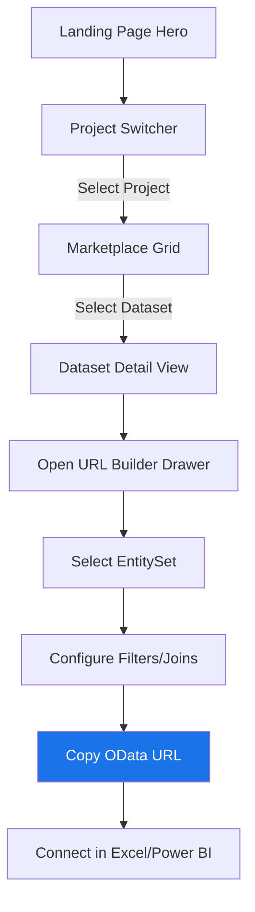
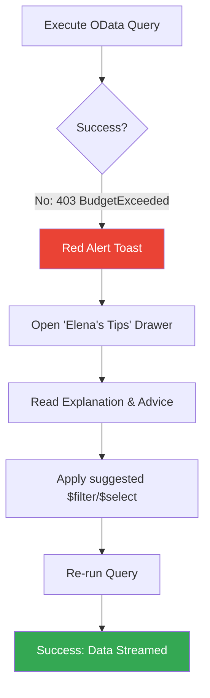

# UX Design Specification odata-gateway-bq

**Author:** Amine_mokhtari
**Date:** 2026-04-25

---

## Executive Summary

...

## 2. Core User Experience

...

## Visual Design Foundation

### Color System (Google Cloud Console Palette)

| Token | Value | Hex | Usage |
| :--- | :--- | :--- | :--- |
| **Primary** | Google Blue | `#1a73e8` | Call-to-actions, primary links |
| **Success** | Google Green | `#34a853` | "Safety-Green" dry-runs, connected status |
| **Warning** | Google Yellow | `#fbbc04` | "Caution-Amber" budget alerts |
| **Error** | Google Red | `#ea4335` | Scan blocked, authorization failures |
| **Neutral** | Dark Grey | `#5f6368` | Secondary text, inactive states |
| **Surface** | Light Grey | `#f8f9fa` | Page background |

### Typography System

- **Tone**: Professional, technical, and high-density.
- **Primary Typeface**: **Roboto** (Google's standard UI font).
- **Mono Typeface**: **Roboto Mono** (Essential for OData queries and BigQuery results).
- **Hierarchy**: Focused on clear data headers and efficient body text for large datasets.

### Spacing & Layout Foundation

- **Feel**: Dense and efficient (optimizing for data analysis).
- **Grid**: 8px baseline grid with 4px micro-increments.
- **Layout Principles**:
    1. **Data Density**: Maximize screen real estate for BigQuery results.
    2. **Contextual Cards**: Group related governance signals (budgets, dry-runs) in clean, card-based layouts.
    3. **Consistency**: Align all component padding and margins with the Google Cloud Console standard.

### Accessibility Considerations

- **Contrast**: All text/background combinations will meet WCAG Level AA (minimum 4.5:1 ratio).
- **Focus States**: High-visibility blue focus rings to ensure keyboard navigability.
- **Color Blindness**: All status indicators (Green/Yellow/Red) will be accompanied by iconography (Check/Alert/Block) to ensure clarity without color.

## Design Direction Decision

### Design Directions Explored

We explored multiple iterations of the "Cloud Native" aesthetic, focusing on how to adapt Google Cloud's Material Design 3 system to a focused OData Gateway experience.

### Chosen Direction: "The Cloud Native Marketplace"

This direction prioritizes functional density and platform consistency.
- **Layout**: Sticky top-bar navigation for primary modules with a centered, high-focus Marketplace layout. Removed the persistent left sidebar to maximize horizontal space for complex OData URL builders.
- **Identity Context**: A high-visibility "Identity Pill" in the top-bar provides real-time status of the verified organizational or anonymous session.
- **Dashboard Layout**: A focused Connection Builder model. The Marketplace provides a streamlined interface for tenant and dataset selection, with real-time connection status feedback.
- **Interaction Pattern**: "Proactive Guidance" using the side-drawers for "Elena's Advice" to keep the main content focused on connection parameters.

### Design Rationale

- **Trust & Familiarity**: By mimicking the Google Cloud environment, we reduce the cognitive load for data analysts already working in BigQuery.
- **Information Density**: The 4px/8px grid allows us to display complex OData schemas and large table previews without excessive scrolling.
- **Governance Signaling**: Using standard Google Cloud status colors (Green/Amber/Red) makes the scan budget circuit breaker immediately intuitive.

### Implementation Approach

Use **Shadcn/UI** as the base, customized with Google Cloud colors and density overrides. Global styles will enforce Roboto as the primary font and Roboto Mono for all data-centric views.

## User Journey Flows

### Journey 1: Connecting a BI Tool (The "Elena" Workflow)

This journey focuses on getting an analyst from a raw BigQuery dataset to a functional OData URL for their BI tool using the "Cloud Native" layout.

### Journey 2: Actionable Error Recovery

This journey empowers users to self-correct technical scan errors using the "Elena's Tips" system integrated into the Console sidebar/drawer.

### Journey Patterns

Across these flows, we standardize on the following patterns:
- **Navigation**: Use the standard Google Cloud sidebar for switching between "Marketplace" (Discovery) and "Governance" (Usage/Budgets).
- **Configuration**: All "Build-time" configurations (URL parameters, filters) happen in **Side Drawers** to keep the main data view clean.
- **Feedback**: Use "Pulse Badges" (Emerald for connected, Amber for caution) to signal connection health and budget status.

### Flow Optimization Principles

1. **Zero-Click Discovery**: Default to the current GCP project context to reduce initial clicks.
2. **Actionable Context**: Never show an error without an "Elena's Tip" side-drawer action.
3. **Copy-to-Clipboard First**: Every URL generation point has a primary blue action button for copying.

## Component Strategy

### Design System Components (Shadcn/UI + Google Cloud Style)

We use **Shadcn/UI** as our structural foundation, applying a "Google Cloud Skin" via CSS variables and Tailwind tokens.
- **Navigation**: Collapsible left-nav with `#1a73e8` active states.
- **Project Switcher**: Top-bar popover with search-in-place functionality.
- **Drawers**: Right-aligned sheets for the URL Builder and "Elena's Tips".
- **Status Alerts**: High-contrast toasts for governance signals.

### Custom Components

#### Dry-Run Pulse Badge
- **Purpose**: Real-time visual feedback on BigQuery scan costs.
- **Usage**: Displayed next to OData URLs and query previews.
- **States**: Safe (Green Pulse), Caution (Amber Pulse), Blocked (Red Static).
- **Interaction**: Hovering reveals a tooltip with estimated scan volume and remaining budget.

#### Elena's Tips Drawer
- **Purpose**: Transform technical OData/BigQuery errors into business advice.
- **Content**: Error explanation + 2-3 clickable "Quick Fixes" (e.g., "Apply Date Filter").
- **Accessibility**: ARIA-live announcements when tips are updated.

### Component Implementation Strategy

- **Density**: Enforce a `density: compact` rule for all data tables to match the "Console" feel.
- **Typography**: Hard-code **Roboto** for UI labels and **Roboto Mono** for any BigQuery-derived content or SQL previews.
- **Consistency**: All custom components are built using the same atomic tokens defined in the Visual Foundation.

## UX Consistency Patterns

### Button Hierarchy

We follow the Material Design 3 elevation and color system for all user actions.
- **Primary Action**: Solid Google Blue (`#1a73e8`) with White text. Used for "Copy OData URL", "Refresh Schema", and main CTAs.
- **Secondary Action**: Outlined Grey (`#5f6368`) or Blue. Used for "Cancel Scan" or "Reset Filters".
- **Tertiary Action**: Text-only Blue. Used for secondary links like "See SQL Explain".

### Feedback Patterns

- **Success**: Emerald Green Pulse Badge + "Connection Verified" Toast.
- **Warning/Caution**: Amber Pulse Badge + Yellow banner for non-blocking budget warnings.
- **Error**: Red Static Badge + Persistent "Elena's Tip" Drawer for actionable recovery.

### Navigation Patterns

- **Global Context**: The top-bar **Identity Pill** is the "Source of Truth" for security. It dynamically reflects the verified organizational or anonymous session.
- **Top-Bar Navigation**: Unified navigation for switching between the Marketplace and other core modules, reducing vertical clutter.
- **Configuration**: All query builders and Elena's advice are housed in **Right-aligned Drawers (Sheets)** to maintain focus on the underlying connection parameters.

### Additional Patterns

- **Hover States**: Subtle `bg-blue-50` or opacity shifts for interactive elements.
- **Focus States**: 2px blue ring around all interactive elements to ensure high-visibility keyboard accessibility.
- **Empty States**: Google Cloud-style "Ghost Illustrations" (grey-scaled) with a clear, primary CTA to get started.

## Responsive Design & Accessibility

### Responsive Strategy

We prioritize a high-density interface that adapts across devices while maintaining platform consistency.
- **Desktop (1024px+)**: Fixed left-hand sidebar. Project Switcher in the top-bar. High-density Marketplace grid.
- **Tablet (768px - 1023px)**: Sidebar collapses to icons-only. Marketplace grid adjusts to 2 columns.
- **Mobile (320px - 767px)**: Sidebar moves to a "Hamburger" menu. Primary CTAs (like "Copy URL") are pinned to a fixed **Bottom Action Bar** for thumb-friendly reachability.

### Breakpoint Strategy

- **Mobile**: 320px - 767px
- **Tablet**: 768px - 1023px
- **Desktop**: 1024px+

### Accessibility Strategy (WCAG 2.1 Level AA)

- **Contrast**: All Google Blue `#1a73e8` links and primary buttons maintain a 4.5:1 ratio.
- **Keyboard Navigation**: Full tabbing support for the Marketplace discovery flow with high-visibility blue focus rings.
- **Screen Readers**: "Elena's Tips" drawers use `aria-live="polite"` to announce new guidance.
- **Touch Targets**: Minimum 44x44px for all mobile interaction points.

### Testing Strategy

- **Automated**: Use Lighthouse and AXE for score-based validation.
- **Manual**: Keyboard-only navigation testing and screen reader verification (VoiceOver/NVDA).
- **Visual**: Color blindness simulation to ensure Red/Amber/Green status badges are distinguishable by shape/icon.

### Implementation Guidelines

- **Units**: Use `rem` for typography and standard `8px` increments for spacing.
- **Semantic HTML**: Mandatory use of `<main>`, `<nav>`, `<aside>`, and `<section>` to ensure structural clarity for assistive technologies.
