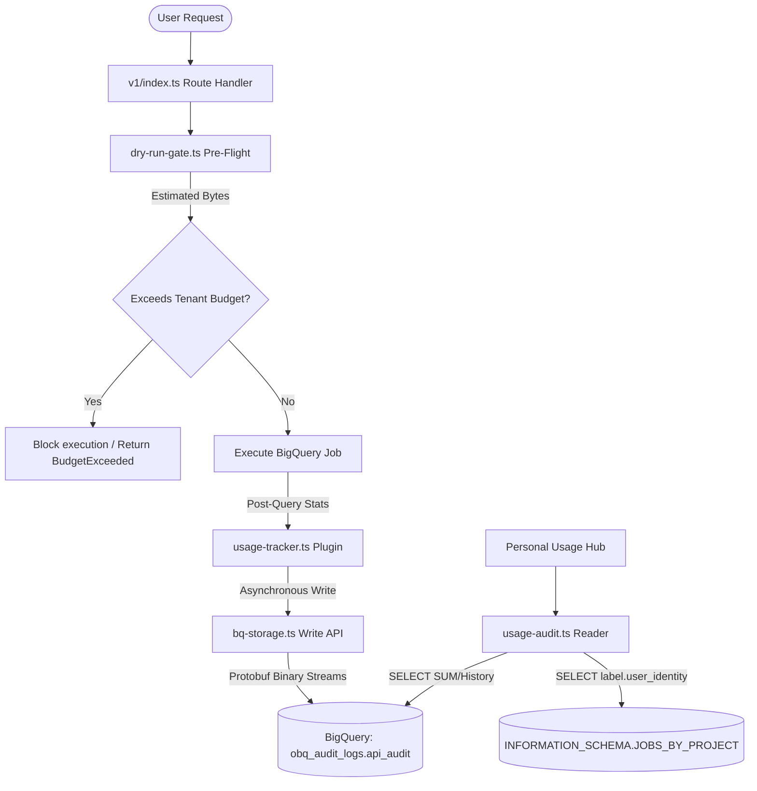

# Core Gateway & Governance - Deep Dive Documentation

**Generated:** 2026-05-13
**Scope:** Core OData Translation, Governance Enforcement, and Visual Connection Builder
**Files Analyzed:** 7
**Lines of Code:** ~1949
**Workflow Mode:** Exhaustive Deep-Dive

## Overview

This deep-dive covers the primary interface and enforcement layer of the **odata-gateway-bq**. It analyzes how the system translates OData v4 queries into BigQuery SQL, enforces real-time scan budgets via dry-runs, and provides narrative governance feedback to users through "Elena's Tips".

**Purpose:** To provide a seamless, governed bridge between business tools (Excel/Power BI) and BigQuery.
**Key Responsibilities:**
- Visual query building ($select, $expand, $apply).
- Real-time BigQuery scan budget enforcement.
- Technical-to-business error mapping.
- Secure session-based authentication and OIDC bridge.
**Integration Points:**
- **Google Cloud BigQuery API**: For dry-runs, query execution, and metadata introspection.
- **OData V4 Specification**: Compliance for BI tool interoperability.
- **Fastify & Next.js**: Hybrid BFF architecture.

## Complete File Inventory

### frontend/src/components/catalog/ODataUrlBuilder.tsx

**Purpose:** The central UI component for visually constructing OData URLs and managing the connection lifecycle.
**Lines of Code:** 801
**File Type:** TypeScript (React Component)

**What Future Contributors Must Know:**
This is a high-complexity component that manages a large reactive state. Changes to the URL generation logic (useEffect) must be carefully verified against the OData V4 parser. It distinguishes between `internalProxyBase` (browser-side fetches) and `publicGatewayBase` (direct source for Excel).

**Exports:**
- `ODataUrlBuilder` - The main functional component for the connection builder.

**Dependencies:**
- `lucide-react` - UI icons.
- `@/hooks/useEntityMetadata` - Introspection logic.
- `@/store/project-store` - Global governance state.
- `@/lib/error-mapping` - Technical error translation.

**Used By:**
- `frontend/src/app/catalog/[projectId]/[datasetId]/page.tsx`

**Key Implementation Details:**
```tsx
// Reactive URL construction (Story 6.3 $apply integration)
if (selectedGroupBy.length > 0 || Object.keys(selectedAggs).length > 0) {
  let apply = '';
  if (selectedGroupBy.length > 0) {
    apply += `groupby((${selectedGroupBy.join(',')})`;
    if (Object.keys(selectedAggs).length > 0) {
      const aggs = Object.entries(selectedAggs)
        .map(([col, func]) => `aggregate(${col} with ${func} as ${col}_${func})`)
        .join(',');
      apply += `,${aggs}`;
    }
    apply += ')';
  }
  params.push(`$apply=${apply}`);
}
```

**Patterns Used:**
- Reactive Builder: The URL is derived in a `useEffect` based on UI selections.
- Multi-Stage Error Extraction: Handles custom field tips, standard OData details, and utility mapping.

**State Management:** Local React state for UI selections; `useProjectStore` (Zustand) for governance drawers.
**Side Effects:** API calls to `/v1/...` for table discovery and usage metrics.
**Error Handling:** Guarded fetch with content-type checking and multi-tier mapping to Elena Tips.

---

### obq-gateway/src/routes/v1/index.ts

**Purpose:** The primary API surface for OData data access and administrative controls.
**Lines of Code:** 618
**File Type:** TypeScript (Fastify Plugin)

**What Future Contributors Must Know:**
This file orchestrates the entire "Audit-Execute" pipeline. It handles metadata caching, OData-to-SQL translation, dry-run validation, and result streaming. It is critical for performance (streaming) and security (job isolation).

**Exports:**
- `v1` (Default) - Fastify plugin containing all V1 routes.

**Dependencies:**
- `../../lib/sql-generator.js` - Translation engine.
- `../../middleware/audit/dry-run-gate.js` - Governance enforcement.
- `../../services/bq-executor.js` - Execution and streaming.

**Used By:**
- `obq-gateway/src/app.ts` (Registered as a plugin)

**Key Implementation Details:**
```typescript
// Smart Paging & Job Isolation (Story 8.1)
if (skiptoken) {
  const jobId = skiptoken.substring(0, lastColonIndex)
  job = await getJob(bq, jobId, metadata.location)
  const jobLabels = job.metadata.configuration?.labels || {}
  if (jobLabels.user_identity !== sanitizeLabelValue(userEmail)) {
    return reply.code(403).send({ error: { code: 'AccessDenied' } })
  }
}
```

**Patterns Used:**
- Pipeline Streaming: Uses `pipeline` to stream BigQuery results through an OData envelope transformer directly to the response.
- Job Labeling: Every BQ job is labeled with `correlation_id` and `user_identity` for auditability.

**Side Effects:** Creates BigQuery jobs; Manages metadata caches; Records usage audit pulses.
**Error Handling:** Translates internal SQL errors into OData-compliant responses with `ELENA_TIP` details.

---

### obq-gateway/src/middleware/audit/dry-run-gate.ts

**Purpose:** Enforces governance rules by performing BigQuery dry-runs before query execution.
**Lines of Code:** 54
**File Type:** TypeScript (Utility)

**What Future Contributors Must Know:**
This is the "Circuit Breaker" of the gateway. It prevents high-cost queries from ever running. It throws a typed `BudgetExceeded` error that is caught by the route handler and translated into user feedback.

**Exports:**
- `validateScanBudget(options: DryRunGateOptions): Promise<number>` - Validates estimate against budget.

**Key Implementation Details:**
```typescript
if (estimatedBytes > budgetBytes) {
  const error = new Error(`Query estimate exceeds budget`)
  error.code = 'BudgetExceeded'
  throw error
}
```

---

### frontend/src/lib/error-mapping.ts

**Purpose:** Maps technical OData/BigQuery error codes to business-friendly, actionable advice.
**Lines of Code:** 78
**File Type:** TypeScript (Utility)

**What Future Contributors Must Know:**
This is where the "Elena" persona is defined. New governance rules added to the backend should have a corresponding mapping here to maintain a friendly UX.

**Exports:**
- `mapErrorToElenaAdvice(code: string, datasetId?: string): ElenaAdvice`

---

### obq-gateway/src/plugins/usage-tracker.ts

**Purpose:** Intercepts Fastify request lifecycles to track query usage and user active pulses per tenant dataset.
**Lines of Code:** 110
**File Type:** TypeScript (Fastify Plugin)

**What Future Contributors Must Know:**
* Decorates the Fastify instance with a global `usageTracker` helper.
* Tracks in-memory metrics for fast query/pulse checking but delegates persistent storage asynchronously to avoid execution blockages.

**Exports:**
* Global `usageTracker` decorator with `recordUsage`, `getUsage`, `recordPulse`, `getPulse`, and `clear`.

---

### obq-gateway/src/services/bq-storage.ts

**Purpose:** Manages the low-level connection to the BigQuery Storage Write API and serializes logs into Protocol Buffer binary arrays.
**Lines of Code:** 132
**File Type:** TypeScript (Service)

**What Future Contributors Must Know:**
* Employs a lazy-loaded `BigQueryWriteClient` to ensure Fastify starts up instantly without blocking on credential resolution.
* Expects payloads conforming to the `AuditEvent` protobuf schema and writes them using the default stream (`_default`).

**Exports:**
* `BigQueryStorageService` - The core persistent logging service.

---

### obq-gateway/src/services/usage-audit.ts

**Purpose:** Fetches monthly metrics and query histories for a specific user to display in the frontend personal hub.
**Lines of Code:** 160
**File Type:** TypeScript (Service)

**What Future Contributors Must Know:**
* Executes high-performance parallel queries on BigQuery to compute user consumption metrics.
* Reads from `INFORMATION_SCHEMA.JOBS_BY_PROJECT` for total monthly billed bytes, and the custom `api_audit` table for global logs and recent history.

**Exports:**
* `getUserUsage(bq, email, location)` - Fetches localized project-level monthly consumption and the last 10 query activities.
* `getGlobalUserUsage(bq, email)` - Fetches cross-project global monthly bytes and the last 50 queries.

---

## Auditing & Observability Deep Dive

To ensure robust cost governance and compliance while keeping database access fast, the gateway splits telemetry into a **high-throughput write pipeline** and a **segregated read/enforcement pipeline**:



### Key Mechanisms:
1. **Preventive Cost Control (Gatekeeper):**
   Enforced purely via the BigQuery Dry Run engine on the SQL translation of the incoming request. Because it uses dry runs, it estimates query sizes *before* scanning any database rows, preventing accidental multi-terabyte queries.
2. **Persistent Logs (Write-Path):**
   The Write Path relies on `BigQueryStorageService` which streams structured protobuf data directly into `obq_audit_logs.api_audit` via gRPC. Using gRPC + Protobuf ensures that logging overhead is minimal and does not impact query latency.
3. **Observability Reports (Read-Path):**
   When the user opens their personal hub, the `usage-audit.ts` service aggregates their usage by combining:
   * **Project-Level Usage:** Queried from native `INFORMATION_SCHEMA.JOBS_BY_PROJECT` (leveraging the `user_identity` label automatically injected into every job).
   * **Global Cross-Project Usage & Action History:** Queried directly from your custom `api_audit` table.

---

## Contributor Checklist

- **Risks & Gotchas:** 
  - Direct OData URLs provided to Excel must NOT contain the `/web/` prefix or they will fail due to OIDC redirection loops.
  - Job isolation depends on accurate `user_identity` labeling in BigQuery.
- **Pre-change Verification Steps:** 
  - Ensure any new OData parameter added is supported by `odata-v4-parser` in the backend.
  - Test streaming with at least 500+ rows to verify $skiptoken generation.
- **Suggested Tests Before PR:** 
  - `npm run test` to verify paging and budget enforcement.
  - Manual verification of OData URL in Excel "OData Feed" source.

## Architecture & Design Patterns

### Code Organization
The project follows a **Hybrid BFF (Backend-for-Frontend)** pattern. The backend handles heavy-duty OData translation and BQ streaming, while the frontend provides a reactive builder that mimics the "Power Query" experience.

### Design Patterns
- **Trusted Subsystem**: The gateway executes queries using a master service account while enforcing row-level/project-level access rules internally.
- **Stateless Streaming**: Result streaming uses Node.js `pipeline` to maintain a low memory footprint even for millions of rows.

## Data Flow

1. **Introspection**: Frontend calls `/v1/:project/:dataset` to list tables.
2. **Configuration**: User selects tables/columns/joins in `ODataUrlBuilder`.
3. **Audit**: Upon fetch request, `dry-run-gate` estimates cost.
4. **Execution**: If budget is OK, `bq-executor` starts a labeled job.
5. **Streaming**: `ODataEnvelopeTransformer` wraps raw JSON into OData-compliant structures.

## Integration Points

### APIs Exposed
- **GET `/v1/:projectId/:datasetId/:entitySet`**: The main data endpoint.
  - Method: GET
  - Request: OData Query Parameters ($select, $filter, $expand, $apply, $skiptoken)
  - Response: OData V4 JSON Envelope (`@odata.context`, `value`, `@odata.nextLink`)

---
_Generated by `document-project` workflow (deep-dive mode)_
_Base Documentation: docs/index.md_
_Scan Date: 2026-05-13_
_Analysis Mode: Exhaustive_
