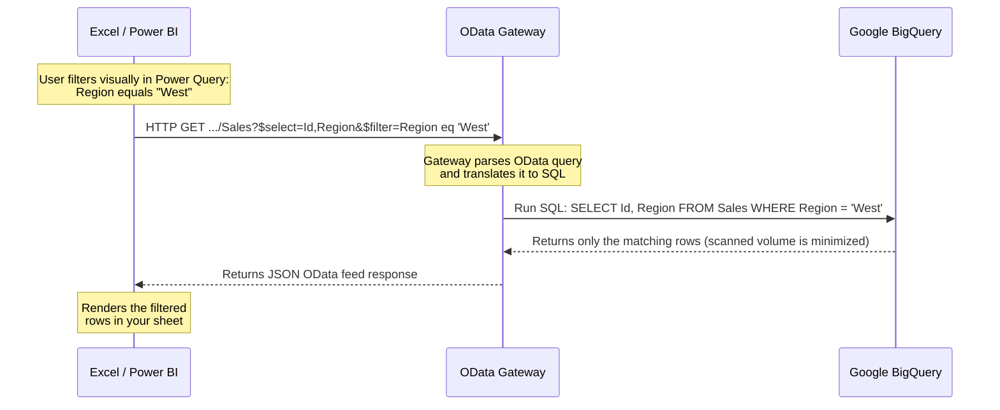

# Getting Started Guide: Connecting to the Data Catalog

Welcome to the **OData Gateway for BigQuery**. This guide will help you connect your favorite data tools (Excel, Power BI, etc.) to your organization's BigQuery datasets in minutes.

## Prerequisites
- An active **Office 365 / Microsoft Entra ID** account (if your organization uses Entra ID).
- Access to your organization's **Data Catalog Portal**.
- **Microsoft Excel** (2016 or later) or **Power BI Desktop**.

---

## The Data Catalog Experience

Instead of manually typing OData URLs, we recommend using the **Data Catalog Portal**.

1. Navigate to the Data Catalog URL provided by your administrator.
2. Browse or search for available BigQuery datasets.
3. Click on a dataset to view its tables, descriptions, and metadata.
4. **Usage Hub:** Check the top navigation bar to access your **Personal Usage Hub**, where you can monitor your monthly query usage and recent job history.

---

## One-Click Excel Integration

The easiest way to connect to a dataset is via the Catalog's One-Click Excel integration:

1. In the Data Catalog, navigate to your desired dataset and table.
2. Click the **"One-Click Excel"** (or Download `.odc`) button.
3. Open the downloaded `.odc` (Office Data Connection) file.
4. Excel will automatically launch and prompt you for authentication.
5. Select **Organizational Account**, sign in, and your data will begin loading automatically!

---

## Manual Connection via Microsoft Excel

1. **Open Excel** and create a new workbook.
2. Go to the **Data** tab in the ribbon.
3. Select **Get Data** > **From Other Sources** > **From OData Feed**.
4. **Enter your URL:** Paste the OData Gateway URL provided by your administrator.
5. **Authentication:**
   - In the login window, select **Organizational Account**.
   - Click **Sign in**.
   - Use your standard work email and password.
6. **Select Data:** Once connected, a "Navigator" window will appear showing all available tables and views in your dataset.
7. **Load:** Select the table you want and click **Load**.

## Connecting via Power BI Desktop

1. **Open Power BI Desktop**.
2. Click **Get Data** in the Home ribbon and select **OData feed**.
3. **URL:** Enter your OData Gateway URL and click **OK**.
4. **Authentication:**
   - Select **Organizational account** on the left sidebar.
   - Click **Sign in** and complete the login process.
   - Click **Connect**.
5. **Navigator:** Select the tables you need and click **Load** or **Transform Data**.

---

## Row-Level Filtering & "Query Folding" (Highly Recommended)

When working with large BigQuery datasets, **do not load the entire table first and then filter it**. Doing so scans more data, increases query execution times, and can consume your personal query budget.

Instead, leverage **Query Folding**. Both Microsoft Excel and Power BI support this natively over OData feeds. This means any filter you apply visually inside your tool is automatically translated into an OData `$filter` parameter and sent back to the BigQuery engine to run as a native `WHERE` clause.

### Step-by-Step: Filtering your Data Visually
1. When connecting via Excel or Power BI, do not click **Load** immediately in the *Navigator* window. Instead, click **Transform Data**.
2. This opens the **Power Query Editor**.
3. Locate the column you want to filter (e.g., `Region`, `EventDate`, or `Status`).
4. Click the **drop-down arrow** in that column's header.
5. Apply your desired filter (e.g., select specific values, or use *Date Filters* to specify a date range).
6. Click **Close & Apply** in the top-left corner.
7. Only the filtered data will be scanned on BigQuery and loaded into your tool.

---

## Tips for Success & Elena's Advice
- **Use Filters:** If you are working with large datasets, use the OData filter options or the "Transform Data" view in Power BI to limit the data you pull.
- **Stay Connected:** Your credentials are saved securely. You can refresh your data anytime by clicking **Refresh** in your tool.
- **Advanced Joins (1:N):** You can now build complex joins visually in the Data Catalog. If a table has related data (e.g., an Order having multiple Line Items), you can select these in the "Related Data" section to include them in your export.
- **Elena's Tips:** If you encounter an error (such as a 403 Budget Exceeded or 401 Unauthorized), the Catalog UI will automatically slide out the **Elena Drawer**. This provides you with plain-English explanations and actionable buttons to fix the issue (e.g., "Select fewer columns").
- **Budget Limits:** Keep an eye on your Personal Usage Hub. Every query is pre-estimated to protect your organization from cost spikes.

