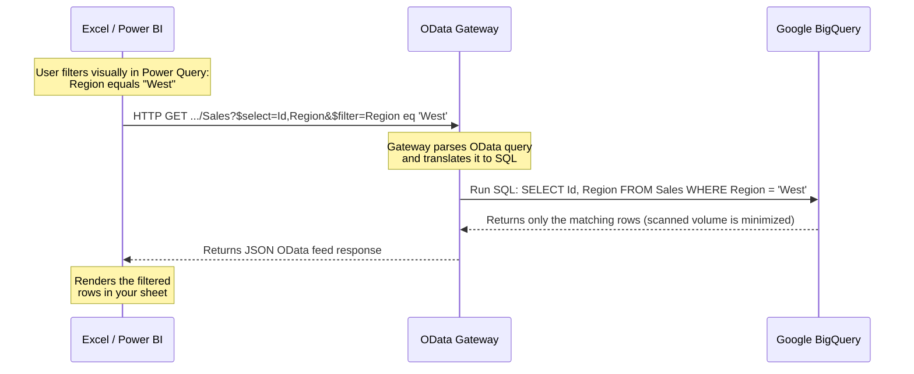

# How-To Guide: Optimizing Queries with Query Folding

When working with large BigQuery datasets, **do not load the entire table first and then filter it inside your BI tool**. Doing so scans unnecessary data, increases query execution times, and can quickly deplete your personal query budget.

Instead, leverage **Query Folding**. Both Microsoft Excel and Power BI support this natively over OData feeds. Any filter you apply visually inside your tool is automatically translated into an OData `$filter` parameter and sent back to the BigQuery engine to execute as a native `WHERE` clause.

## How to Filter Your Data Visually (Excel & Power BI)

1. During the connection process in Excel or Power BI, when the *Navigator* window appears, do not click **Load** immediately.
2. Click **Transform Data**. This opens the **Power Query Editor**.
3. Locate the column you want to filter (e.g., `Region`, `EventDate`, or `Status`).
4. Click the **drop-down arrow** in that column's header.
5. Apply your desired filter (e.g., select specific values, or use *Date Filters* to specify a date range).
6. Click **Close & Apply** in the top-left corner.

Only the filtered data will be scanned on BigQuery and loaded into your tool, minimizing your scanned volume and preventing budget overruns.

## How it Works Under the Hood

