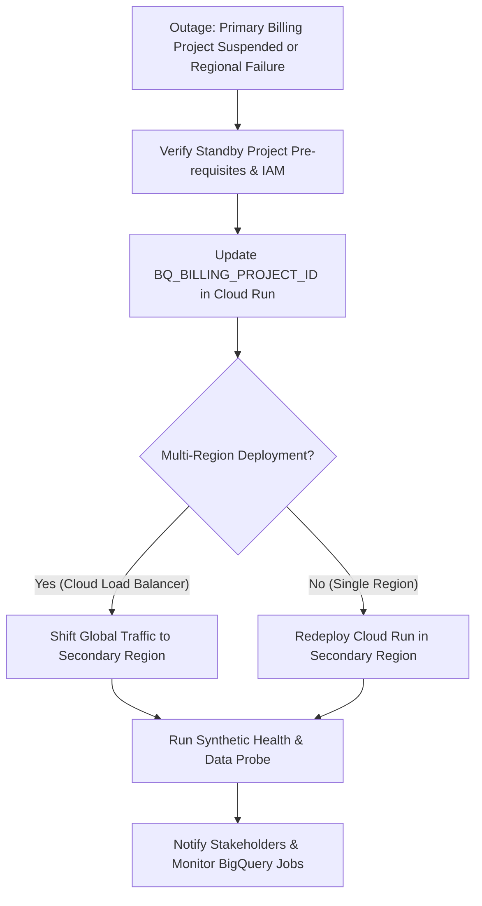

# Runbook: Billing Project Switchover & Multi-Region Failover

| Attribute | Value |
| :--- | :--- |
| **Runbook ID** | RB-10 |
| **Severity** | P1 (Critical / Disaster Recovery) |
| **Component** | `obq-gateway` (`config.ts`, `BQ_BILLING_PROJECT_ID`), Cloud Run Multi-Region |
| **Error Code** | Billing account disabled / BigQuery project quota suspended / Regional outage |
| **Primary Audience** | Enterprise Architecture, FinOps, Disaster Recovery Lead |

---

## 1. Overview & Impact

The gateway leverages a **Decoupled Billing Architecture** where all query jobs are executed inside a designated billing/execution project (`BQ_BILLING_PROJECT_ID`), while reading data from decentralized source projects.

If the primary billing project is suspended due to billing account issues, budget caps, or regional GCP infrastructure outages, data processing halts across all tenants. This runbook executes an emergency switchover to a standby execution project or secondary GCP region.

---

## 2. Prerequisites

* Standby GCP Project provisioned (e.g., `company-bq-execution-dr`).
* BigQuery API enabled on the standby project.
* Gateway Service Account granted `roles/bigquery.jobUser` on the standby project.
* Audit dataset (`obq_audit_logs`) and table (`api_audit`) initialized in the standby project.

---

## 3. Failover Execution Workflow



### Step 1: Rapid Verification of Standby Execution Project
Ensure the standby project is ready to accept jobs:
```bash
# Verify BigQuery API is enabled
gcloud services list --project=<STANDBY_PROJECT_ID> --filter="NAME:bigquery.googleapis.com"

# Verify Service Account permissions on standby project
gcloud projects get-iam-policy <STANDBY_PROJECT_ID> \
  --flatten="bindings[].members" \
  --filter="bindings.members:<GATEWAY_SERVICE_ACCOUNT_EMAIL>"
```

### Step 2: Switch the Billing Project on Cloud Run
Update the `BQ_BILLING_PROJECT_ID` environment variable on the primary service:

```bash
gcloud run services update odata-gateway \
  --region="<REGION>" \
  --update-env-vars BQ_BILLING_PROJECT_ID="<STANDBY_PROJECT_ID>"
```

*Downtime Impact:* Cloud Run will deploy a new revision seamlessly, draining active requests on the old revision and routing new queries to the standby project.

### Step 3: Regional Cloud Run Failover (If Cloud Region is Degraded)
If the entire GCP region (e.g., `us-central1`) is experiencing an outage:

1. Deploy the gateway container in the secondary region (e.g., `us-east4`):
   ```bash
   gcloud run deploy odata-gateway \
     --image="<IMAGE_FROM_ARTIFACT_REGISTRY>" \
     --region="us-east4" \
     --platform=managed \
     --service-account="<GATEWAY_SERVICE_ACCOUNT_EMAIL>" \
     --set-env-vars \
       BQ_BILLING_PROJECT_ID="<STANDBY_PROJECT_ID>",\
       OIDC_ISSUER="<OIDC_ISSUER>",\
       OIDC_AUDIENCE="<OIDC_AUDIENCE>"
   ```

2. If using **Cloud Load Balancing (Serverless NEG)**:
   * Add the new regional Cloud Run service to the backend service.
   * Traffic will immediately route to the healthy regional endpoint.

---

## 4. Verification

1. Execute a synthetic test query against the gateway:
   ```bash
   curl -i -G "https://<gateway-domain>/v1/<PROJECT_ID>/<DATASET_ID>/<TABLE>?\$top=1" \
     -H "Authorization: Bearer <TOKEN>"
   ```
2. Verify that BigQuery query jobs are registered under the new billing project:
   ```sql
   SELECT
     job_id,
     project_id,
     user_email,
     creation_time
   FROM `<STANDBY_PROJECT_ID>.`region-us`.INFORMATION_SCHEMA.JOBS_BY_PROJECT`
   ORDER BY creation_time DESC
   LIMIT 1;
   ```
3. Confirm that persistent audit logs are being streamed into `<STANDBY_PROJECT_ID>.obq_audit_logs.api_audit`.

---

## 5. Failback Procedure
Once the primary project or region is restored:
1. Re-run Step 2 updating `BQ_BILLING_PROJECT_ID` back to the primary project ID during an off-peak maintenance window.
2. Backfill audit records from the standby project's `api_audit` table into the primary audit table using a simple `INSERT INTO ... SELECT * FROM` job.
