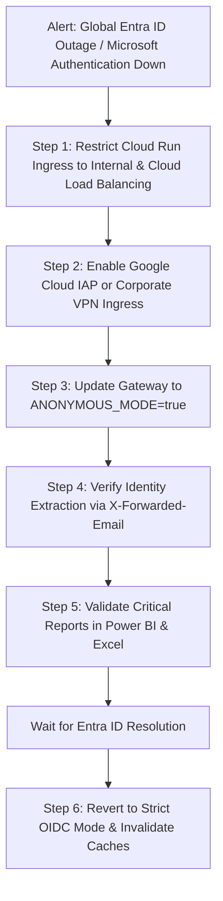

# Runbook: Identity Provider Outage Emergency Fallback

| Attribute | Value |
| :--- | :--- |
| **Runbook ID** | RB-11 |
| **Severity** | P1 (Critical / Disaster Recovery) |
| **Component** | `obq-gateway` (`plugins/auth.ts`, `ANONYMOUS_MODE`), Google Cloud IAP |
| **Trigger** | Global Microsoft Entra ID / Azure AD Authentication Outage |
| **Primary Audience** | Chief Information Security Officer (CISO), Cloud IAM Leads, SRE |

---

## 1. Overview & Impact

If Microsoft Entra ID suffers a global or regional outage, all OIDC token issuance and JWKS discovery operations fail. End users in Power BI and Excel are completely locked out of the gateway, even though Google Cloud and BigQuery infrastructure remain fully operational.

This runbook outlines the **Zero-Trust Emergency Fallback Procedure**: locking down network ingress to the corporate perimeter (VPC/VPN) and activating **Cloud IAP (Identity-Aware Proxy)** or **Header-Offloaded Anonymous Mode** (`ANONYMOUS_MODE=true`) so critical executive reporting can proceed securely.

> [!CAUTION]
> Never enable `ANONYMOUS_MODE=true` on a publicly exposed gateway without perimeter IP restrictions or Cloud IAP in front. Follow the ingress restriction step first.

---

## 2. Emergency Activation Workflow



---

## 3. Step-by-Step Fallback Execution

### Step 1: Restrict Container Ingress to Corporate Perimeter
Ensure that the public internet cannot access the gateway directly:
```bash
gcloud run services update odata-gateway \
  --region="<REGION>" \
  --ingress="internal-and-cloud-load-balancing"
```
*Effect:* Only traffic routed through your internal VPC, VPN, or Cloud Load Balancer can hit the gateway container.

### Step 2: Switch Gateway to Header-Offloaded Mode
Update the Cloud Run service to bypass remote OIDC discovery and accept identity from perimeter headers:

```bash
gcloud run services update odata-gateway \
  --region="<REGION>" \
  --update-env-vars \
    ANONYMOUS_MODE="true",\
    DEFAULT_ANONYMOUS_USER_NAME="EMERGENCY_USER"
```

### Step 3: Configure Cloud IAP or Edge Proxy Headers
When `ANONYMOUS_MODE=true`, `plugins/auth.ts` extracts the active user context from standard proxy headers:
* `x-forwarded-email`: Injected by Cloud IAP or your reverse proxy.
* `x-forwarded-groups`: Injected by your corporate VPN/SSO edge.
* `x-forwarded-sub`: Subject identifier.

All internal dataset access policies in `tenants.yaml` continue to be enforced against `x-forwarded-email`.

### Step 4: Validate Emergency Endpoint Access
Execute a probe simulating perimeter-offloaded traffic:
```bash
curl -i https://<gateway-internal-domain>/v1/<PROJECT_ID>/<DATASET_ID> \
  -H "X-Forwarded-Email: analyst@company.com"
```
Verify:
* Response returns HTTP `200 OK`.
* Audit logging writes the action under `userEmail: analyst@company.com`.

---

## 4. Normal Operations Reversion Procedure

Once Microsoft publishes resolution on the Entra ID status portal:

### Step 1: Re-enable Strict OIDC Authentication
```bash
gcloud run services update odata-gateway \
  --region="<REGION>" \
  --update-env-vars \
    ANONYMOUS_MODE="false"
```

### Step 2: Restore Public or Ingress Settings
Restore ingress to the standard production configuration:
```bash
gcloud run services update odata-gateway \
  --region="<REGION>" \
  --ingress="all"
```

### Step 3: Invalidate Gateway Caches
Force a fresh JWKS fetch and flush in-memory metadata:
```bash
curl -X POST \
  -H "Authorization: Bearer <ADMIN_TOKEN>" \
  https://<gateway-domain>/v1/admin/refresh-all
```

### Step 4: Verify End-User Handshake in Power BI
Have a test user clear credentials and re-authenticate via Microsoft Organizational Account.
