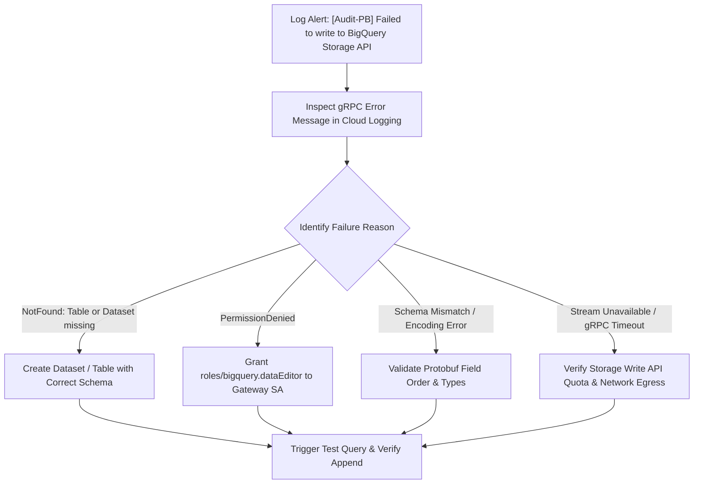

# Runbook: Storage Write API Audit Logging Stream Drop

| Attribute | Value |
| :--- | :--- |
| **Runbook ID** | RB-04 |
| **Severity** | P2 (High) |
| **Component** | `obq-gateway` (`services/bq-storage.ts`, `BigQueryStorageService`) |
| **Error Code** | `[Audit-PB] Failed to write to BigQuery Storage API` / gRPC stream errors |
| **Primary Audience** | Data Governance SRE, BigQuery Administrators |

---

## 1. Overview & Impact

The gateway uses the **BigQuery Storage Write API** (`@google-cloud/bigquery-storage`) with binary Protocol Buffers (`proto3`) over gRPC to stream real-time audit events (`AuditEvent`) directly into the `obq_audit_logs.api_audit` table. This provides non-blocking, high-throughput observability for compliance and user billing tracking.

### Symptoms
* Gateway logs show recurring error messages: `[Audit-PB] Failed to write to BigQuery Storage API: ...`.
* The User Usage Hub (`/v1/usage`) displays missing recent query history or stale monthly metrics.
* Queries to `<BILLING_PROJECT_ID>.obq_audit_logs.api_audit` show no new rows inserted during active gateway traffic.

---

## 2. Prerequisites & Access

* BigQuery Admin or Data Editor permissions on the audit dataset: `roles/bigquery.dataEditor`.
* Access to GCP Service Account IAM roles.
* Cloud Logging access on the billing project.

---

## 3. Diagnostic Workflow



### Step 3.1: Check Exact Storage Write API Error
Query Cloud Logging for `[Audit-PB]` errors:
```bash
gcloud logging read \
  'resource.type="cloud_run_revision" AND textPayload=~"[Audit-PB]"' \
  --project="<BQ_BILLING_PROJECT_ID>" \
  --limit=20 \
  --format="json(timestamp, textPayload)"
```

Common error conditions:
* `NOT_FOUND`: Table `projects/<PROJECT>/datasets/<DATASET>/tables/<TABLE>` does not exist.
* `PERMISSION_DENIED`: Gateway service account lacks write permissions.
* `INVALID_ARGUMENT`: Schema mismatch between Protobuf descriptor and BigQuery table definition.

### Step 3.2: Verify Table Schema Against Protobuf Definition
The table must match the binary Protobuf schema defined in `services/bq-storage.ts`:

| Field ID | Name | BigQuery Data Type | Mode |
| :--- | :--- | :--- | :--- |
| 1 | `timestamp` | `STRING` (or `TIMESTAMP`) | `NULLABLE` |
| 2 | `projectId` | `STRING` | `NULLABLE` |
| 3 | `datasetId` | `STRING` | `NULLABLE` |
| 4 | `userEmail` | `STRING` | `NULLABLE` |
| 5 | `correlationId` | `STRING` | `NULLABLE` |
| 6 | `action` | `STRING` | `NULLABLE` |
| 7 | `bytesProcessed` | `INT64` | `NULLABLE` |
| 8 | `status` | `STRING` | `NULLABLE` |

Check current table schema in BigQuery:
```bash
bq show --schema --format=prettyjson <BQ_BILLING_PROJECT_ID>:obq_audit_logs.api_audit
```

---

## 4. Remediation Procedures

### Procedure A: Create Audit Dataset and Table if Missing
If the dataset or table was not provisioned during initial setup:

1. Create dataset:
   ```bash
   bq --location=US mk --dataset <BQ_BILLING_PROJECT_ID>:obq_audit_logs
   ```

2. Create table matching the Proto descriptor:
   ```bash
   bq mk --table <BQ_BILLING_PROJECT_ID>:obq_audit_logs.api_audit \
     timestamp:STRING,\
   projectId:STRING,\
   datasetId:STRING,\
   userEmail:STRING,\
   correlationId:STRING,\
   action:STRING,\
   bytesProcessed:INT64,\
   status:STRING
   ```

### Procedure B: Grant Storage Write Permissions to Service Account
The gateway service account requires the BigQuery Data Editor role:

```bash
gcloud projects add-iam-policy-binding <BQ_BILLING_PROJECT_ID> \
  --member="serviceAccount:<GATEWAY_SERVICE_ACCOUNT_EMAIL>" \
  --role="roles/bigquery.dataEditor"
```

Also ensure the **BigQuery Storage API** is enabled:
```bash
gcloud services enable bigquerystorage.googleapis.com --project=<BQ_BILLING_PROJECT_ID>
```

### Procedure C: Restart Gateway Container Instance to Reset gRPC Client
The `BigQueryWriteClient` is lazily instantiated and caches gRPC connections. If credentials or network configurations were updated:

```bash
# Force revision redeployment or restart instances
gcloud run services update odata-gateway \
  --region="<REGION>" \
  --update-env-vars RESTART_TRIGGER="$(date +%s)"
```

---

## 5. Verification
* Trigger a query or metadata discovery call:
  ```bash
  curl -i https://<gateway-domain>/v1/<PROJECT_ID>/<DATASET_ID>/$metadata \
    -H "Authorization: Bearer <TOKEN>"
  ```
* Check gateway container logs for success confirmation:
  ```text
  [Audit-PB] Successfully streamed METADATA_REFRESH log for user@company.com
  ```
* Verify row insertion in BigQuery:
  ```sql
  SELECT * FROM `<BQ_BILLING_PROJECT_ID>.obq_audit_logs.api_audit`
  ORDER BY timestamp DESC
  LIMIT 1;
  ```
