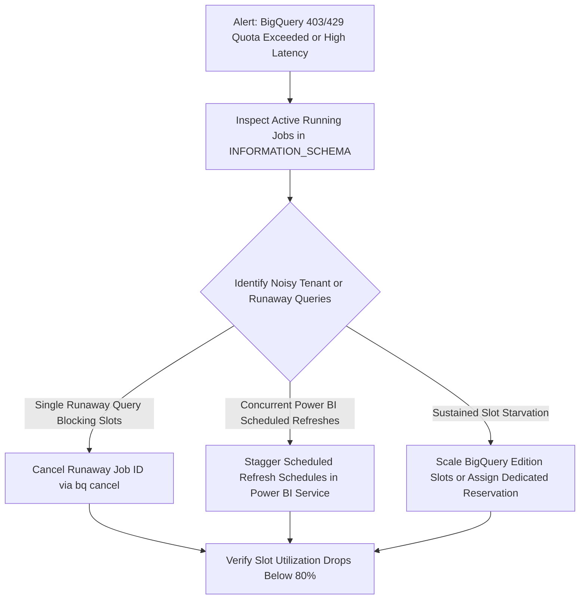

# Runbook: BigQuery Slot Quota Starvation & Concurrency Throttling

| Attribute | Value |
| :--- | :--- |
| **Runbook ID** | RB-05 |
| **Severity** | P2 (High) |
| **Component** | `obq-gateway` (`services/bq-executor.ts`), GCP BigQuery Billing Project |
| **Error Code** | `403 QuotaExceeded` / `429 RateLimitExceeded` / Job Execution Timeouts |
| **Primary Audience** | BigQuery Platform Admins, FinOps, SRE |

---

## 1. Overview & Impact

All queries initiated through the gateway are billed and executed using the centralized **Billing Project** (`BQ_BILLING_PROJECT_ID`). If multiple departments or automated Power BI scheduled refreshes trigger concurrent table scans simultaneously, the billing project can hit BigQuery concurrent query limits (100 concurrent on-demand queries) or exhaust allocated slot reservations, leading to queue delays or job failures.

### Symptoms
* End-users report spinning query spinners in Power BI / Excel that eventually time out.
* Gateway logs show: `googleapi: Error 403: Exceeded rate limits: too many concurrent queries for project`.
* Cloud Monitoring shows BigQuery Slot Utilization at 100% or Query Execution Latency spiking.

---

## 2. Prerequisites & Access

* BigQuery Admin role (`roles/bigquery.admin`) on the billing project.
* Access to **BigQuery Studio** and **Cloud Monitoring**.

---

## 3. Diagnostic Workflow



### Step 3.1: Inspect Active Running Jobs in BigQuery
Run this query in BigQuery Studio to identify all queries currently executing from the gateway:
```sql
SELECT
  job_id,
  user_email,
  (SELECT value FROM UNNEST(labels) WHERE key = 'user_identity') AS initiated_by,
  TIMESTAMP_DIFF(CURRENT_TIMESTAMP(), start_time, SECOND) AS running_seconds,
  total_slot_ms,
  query
FROM `<BQ_BILLING_PROJECT_ID>.`region-us`.INFORMATION_SCHEMA.JOBS_BY_PROJECT`
WHERE state = 'RUNNING'
  AND statement_type = 'SELECT'
ORDER BY running_seconds DESC
LIMIT 25;
```

### Step 3.2: Identify Noisy Tenants via Audit Logs
Identify which tenants or users initiated the highest query volume over the last 30 minutes:
```sql
SELECT
  userEmail,
  projectId,
  datasetId,
  COUNT(*) AS total_queries,
  SUM(bytesProcessed) / (1024 * 1024 * 1024) AS total_gb_processed
FROM `<BQ_BILLING_PROJECT_ID>.obq_audit_logs.api_audit`
WHERE timestamp >= TIMESTAMP_SUB(CURRENT_TIMESTAMP(), INTERVAL 30 MINUTE)
GROUP BY userEmail, projectId, datasetId
ORDER BY total_queries DESC
LIMIT 10;
```

---

## 4. Remediation Procedures

### Immediate Action 1: Cancel Runaway BigQuery Jobs
If a single user or runaway query is consuming slots:
```bash
bq --project_id=<BQ_BILLING_PROJECT_ID> cancel <JOB_ID>
```
The gateway will cleanly capture the job abort and terminate the client stream.

### Immediate Action 2: Stagger Scheduled Refreshes in Power BI Service
If multiple departmental reports are scheduled for the exact top-of-the-hour mark (e.g., 08:00 AM):
1. Identify the report owners from the `initiated_by` job label.
2. In Power BI Service, distribute scheduled dataset refreshes across different time slots (e.g., 08:15, 08:35, 08:50).

### Immediate Action 3: Adjust BigQuery Slot Reservations (Enterprise Mode)
If using BigQuery Editions (Enterprise or Enterprise Plus):
1. Open **BigQuery** > **Capacity Management**.
2. Temporarily increase baseline slots or enable slot auto-scaling on the reservation assigned to the gateway billing project.

### Long-Term Architectural Fix: Decoupled Billing Project Per Domain
If departmental contention continues, split tenant billing projects:
1. Provision dedicated billing projects (e.g., `company-finance-billing`, `company-marketing-billing`).
2. Deploy isolated Cloud Run gateway instances per business unit with dedicated `BQ_BILLING_PROJECT_ID` configurations.

---

## 5. Verification
* Confirm running query count drops back below acceptable thresholds (< 50 concurrent).
* Check Cloud Run metrics to ensure error rate returns to 0%.
