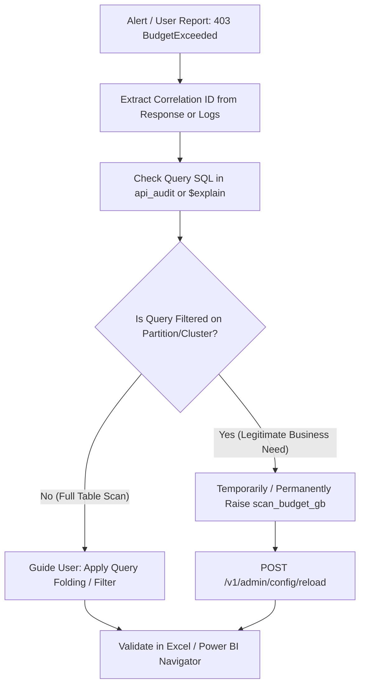

# Runbook: BigQuery Scan Budget Circuit Breaker Trip (`BudgetExceeded`)

| Attribute | Value |
| :--- | :--- |
| **Runbook ID** | RB-01 |
| **Severity** | P2 (High) |
| **Component** | `obq-gateway` (`middleware/audit/dry-run-gate.ts`, `lib/sql-generator.ts`) |
| **Error Code** | `BudgetExceeded` (HTTP 403) |
| **Primary Audience** | Data Platform SRE, FinOps, Data Stewards |

---

## 1. Overview & Impact

The gateway enforces a pre-flight **Dry-Run Circuit Breaker** before executing any BigQuery query. If the estimated bytes to scan exceeds the tenant's configured `scan_budget_gb` in `tenants.yaml`, the gateway immediately rejects the request with HTTP `403` and code `BudgetExceeded`.

### Symptoms
* End-users in **Power BI** or **Microsoft Excel** receive an error dialog: `DataSource.Error: Query estimate (...) exceeds budget (...)`.
* Catalog UI displays the **Elena Drawer** with query reduction tips.
* In Cloud Logging, error logs show `[DryRunGate]` warnings with correlation IDs.

---

## 2. Prerequisites & Access

Ensure you have:
* Access to **GCP Cloud Logging** for the billing project (`roles/logging.viewer`).
* BigQuery read access to `obq_audit_logs.api_audit` (`roles/bigquery.dataViewer`).
* Access to the configuration repository or instance running `obq-gateway` to update `tenants.yaml`.

---

## 3. Diagnostic Workflow



### Step 3.1: Locate the Failed Query by Correlation ID
Find the exact user request and error in GCP Cloud Logging:
```bash
gcloud logging read \
  'resource.type="cloud_run_revision" AND textPayload=~"BudgetExceeded"' \
  --project="<BQ_BILLING_PROJECT_ID>" \
  --limit=10 \
  --format="json(timestamp, textPayload, jsonPayload.correlation_id)"
```

### Step 3.2: Inspect the Dry-Run Estimate & Generated SQL
You can reproduce the exact SQL translation and dry-run scan size directly via the `$explain` endpoint without consuming BigQuery quota:
```bash
curl -G "https://<gateway-domain>/v1/<PROJECT_ID>/<DATASET_ID>/<TABLE_NAME>" \
  --data-urlencode "\$explain=true" \
  --data-urlencode "\$filter=<FAILED_FILTER_EXPRESSION>" \
  -H "Authorization: Bearer <USER_OR_ADMIN_TOKEN>"
```
**Example Response:**
```json
{
  "sql": "SELECT ... FROM `project.dataset.table` WHERE ...",
  "estimatedBytes": 53687091200,
  "budgetBytes": 10737418240,
  "scanBudgetGb": 10,
  "isWithinBudget": false
}
```

### Step 3.3: Inspect Table Partitioning in BigQuery
Verify whether the target table is partitioned or clustered:
```sql
SELECT
  table_name,
  is_partitioning_column,
  clustering_ordinal_position
FROM `<PROJECT_ID>.<DATASET_ID>.INFORMATION_SCHEMA.COLUMNS`
WHERE table_name = '<TABLE_NAME>'
  AND (is_partitioning_column = 'YES' OR clustering_ordinal_position IS NOT NULL);
```

---

## 4. Remediation Procedures

### Option A: Enforce Query Folding in Excel / Power BI (Preferred)
If the user is performing a full table scan on a large partitioned table:
1. Advise the user to avoid clicking **Load** immediately on large tables.
2. Instruct the user to click **Transform Data** (Power Query Editor).
3. Add a filter on the **Date / Partition column** (e.g., `Date >= 2026-01-01`).
4. Power BI will fold this into an OData `$filter=Date ge 2026-01-01T00:00:00Z` query parameter, pruning partitions in BigQuery and dropping the scan size below budget.
5. Refer user to the [Query Folding Guide](../guides/query-folding.md).

### Option B: Increase Scan Budget without Service Downtime
If the query is a legitimate business query that inherently requires scanning more data:

1. Locate `tenants.yaml` (or the path configured by `TENANTS_CONFIG_PATH`):
   ```yaml
   tenants:
     - project_id: "analytics-prod"
       dataset_id: "sales_marts"
       scan_budget_gb: 50   # Raised from 10 to 50 GB
       access_rules:
         groups:
           - "finance-analysts"
   ```

2. Trigger zero-downtime hot reload:
   ```bash
   curl -X POST \
     -H "Authorization: Bearer <ADMIN_TOKEN>" \
     https://<gateway-domain>/v1/admin/config/reload
   ```

3. Confirm response status:
   ```json
   {
     "status": "success",
     "message": "Tenant configuration reloaded",
     "tenantCount": 12
   }
   ```

---

## 5. Verification
* Re-run the request via `$explain=true` to verify `isWithinBudget: true`.
* Have the analyst refresh their report in Power BI or Excel.
* Check Cloud Logging to ensure HTTP `200 OK` is returned.
