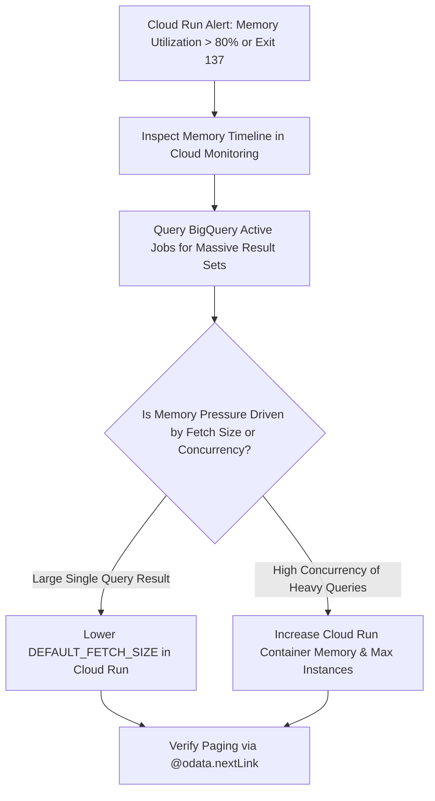

# Runbook: Cloud Run Memory Exhaustion & Container OOM Kills

| Attribute | Value |
| :--- | :--- |
| **Runbook ID** | RB-03 |
| **Severity** | P1 (Critical) |
| **Component** | `obq-gateway` (`services/bq-executor.ts`, `lib/transformers/odata-envelope.ts`) |
| **Error Code** | Container Exit Code `137` (SIGKILL / OOM) / HTTP `502` / `503` |
| **Primary Audience** | Cloud Platform SRE, Performance Engineers |

---

## 1. Overview & Impact

The gateway uses a zero-footprint streaming architecture (`pipeline(bqStream, transformer, reply.raw)`) coupled with Server-Driven Paging (`DEFAULT_FETCH_SIZE`) to maintain a strict memory boundary (< 256MB).

However, if clients initiate massive unpaginated queries or concurrent queries with deeply nested BigQuery `RECORD` or `REPEATED` types, memory consumption can breach container limits, causing Cloud Run to kill the instance with **Exit Code 137**.

### Symptoms
* Cloud Run logs display: `Container called exit(137)` or `Memory limit exceeded`.
* End-users receive HTTP `502 Bad Gateway` or `503 Service Unavailable` mid-stream.
* Memory utilization metric in Cloud Monitoring spikes toward 100%.

---

## 2. Prerequisites & Access

* **Cloud Monitoring** and **Cloud Logging** viewer permissions on the billing project.
* `roles/run.admin` or `roles/run.developer` to modify Cloud Run memory allocations and environment variables.

---

## 3. Diagnostic Workflow



### Step 3.1: Identify OOM Container Termination Events
Query Cloud Logging for container termination logs:
```bash
gcloud logging read \
  'resource.type="cloud_run_revision" AND (textPayload=~"137" OR textPayload=~"Memory limit exceeded")' \
  --project="<BQ_BILLING_PROJECT_ID>" \
  --limit=10 \
  --format="json(timestamp, textPayload, resource.labels.service_name)"
```

### Step 3.2: Query Large Jobs Initiated by Gateway
Identify which user queries returned massive result payloads:
```sql
SELECT
  project_id,
  job_id,
  user_email,
  total_bytes_processed,
  total_rows,
  creation_time,
  end_time
FROM `<BQ_BILLING_PROJECT_ID>.`region-us`.INFORMATION_SCHEMA.JOBS_BY_PROJECT`
WHERE job_type = 'QUERY'
  AND creation_time >= TIMESTAMP_SUB(CURRENT_TIMESTAMP(), INTERVAL 2 HOUR)
  AND labels.key = 'application' AND labels.value = 'odata_gateway'
ORDER BY total_rows DESC
LIMIT 10;
```

### Step 3.3: Verify Server-Driven Paging Output
Test if the gateway is correctly truncating results and emitting `@odata.nextLink`:
```bash
curl -i -G "https://<gateway-domain>/v1/<PROJECT_ID>/<DATASET_ID>/<TABLE_NAME>" \
  -H "Authorization: Bearer <TOKEN>"
```
Verify that the JSON response payload terminates with:
```json
{
  "@odata.context": "...",
  "value": [ ... ],
  "@odata.nextLink": "https://<gateway-domain>/v1/<PROJECT>/<DATASET>/<TABLE>?$skiptoken=...&$top=..."
}
```

---

## 4. Remediation Procedures

### Immediate Action 1: Lower `DEFAULT_FETCH_SIZE`
If queries returning 10,000 large records with nested JSON are causing heap spikes, reduce the default batch size to 2,500 or 5,000 rows:

```bash
gcloud run services update odata-gateway \
  --region="<REGION>" \
  --update-env-vars DEFAULT_FETCH_SIZE=2500
```
*Effect:* Forces BI clients to ingest in smaller chunks via `$skiptoken`, eliminating memory bloat.

### Immediate Action 2: Scale Container Memory Limit
If the service must handle high concurrent streams or complex JSON conversions:

```bash
gcloud run services update odata-gateway \
  --region="<REGION>" \
  --memory=1Gi \
  --cpu=1
```
*(Recommended standard production sizing: 1GiB RAM / 1 vCPU with minimum 1 instance to avoid cold-start memory spikes).*

### Immediate Action 3: Verify Orphan Job Cleanup on Disconnect
The gateway catches `ERR_STREAM_PREMATURE_CLOSE` to kill BigQuery jobs if an analyst closes Excel during a query. Verify in Cloud Logging that client aborts cancel the underlying job:
```bash
gcloud logging read \
  'resource.type="cloud_run_revision" AND textPayload=~"Stream closed prematurely, cancelling BigQuery job"' \
  --project="<BQ_BILLING_PROJECT_ID>" \
  --limit=5
```

---

## 5. Verification
* Monitor Cloud Run container memory in Cloud Console: memory utilization should plateau below 50%.
* Execute a test query fetching > 10,000 rows in Excel/Power BI and verify continuous streaming with zero errors.
