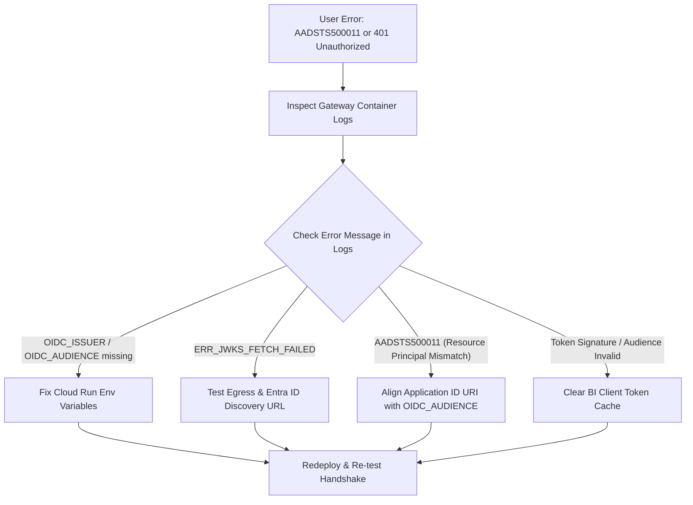

# Runbook: Entra ID / OIDC Token Rejection & Power BI Auth Outage

| Attribute | Value |
| :--- | :--- |
| **Runbook ID** | RB-02 |
| **Severity** | P1 (Critical) |
| **Component** | `obq-gateway` (`plugins/auth.ts`, `middleware/auth/access-control.ts`) |
| **Error Code** | `AADSTS500011` / `401 Unauthorized` / `ERR_JWT_EXPIRED` |
| **Primary Audience** | Identity & Access Management (IAM) Team, SRE, Cloud Architects |

---

## 1. Overview & Impact

The gateway validates Microsoft Entra ID (Azure AD) or standard OIDC JSON Web Tokens (JWT) using the `jose` library. Because Microsoft Power BI and Excel perform strict resource-principal matching, any misalignment between the Entra ID App Registration and the gateway configuration results in an immediate authentication outage for all business users.

### Symptoms
* Power BI Navigator displays: `We couldn't authenticate with the credentials provided. Details: AADSTS500011: The resource principal named https://... was not found in the tenant...`
* Excel users receive repeated authentication prompt loops without successfully connecting.
* Gateway logs show `JWT verification failed` or `Security initialization failed`.

---

## 2. Prerequisites & Access

* Administrative access to **Microsoft Entra ID Admin Center** (App Registrations).
* Access to **GCP Cloud Run** service configurations (`roles/run.admin` or `roles/run.developer`).
* A valid business user account to execute test authentication handshakes.

---

## 3. Diagnostic Workflow



### Step 3.1: Inspect Gateway Logs for Exact JWT Rejection Reason
Run `gcloud logging` to view authentication exceptions:
```bash
gcloud logging read \
  'resource.type="cloud_run_revision" AND (textPayload=~"JWT" OR jsonPayload.err=~"jwt")' \
  --project="<BQ_BILLING_PROJECT_ID>" \
  --limit=20 \
  --format="json(timestamp, textPayload, jsonPayload.msg, jsonPayload.err)"
```

Common error strings:
* `ERR_JWT_CLAIM_VALIDATION_FAILED`: Audience mismatch (`aud` claim in token does not match `OIDC_AUDIENCE`).
* `ERR_JWKS_FETCH_FAILED`: Gateway cannot reach `.well-known/openid-configuration` or `jwks_uri`.
* `ERR_JWT_EXPIRED`: Clock skew between client/server or token expired.

### Step 3.2: Verify Entra ID App Registration Alignment
1. Open **Microsoft Entra ID Admin Center** > **App Registrations** > Select the Gateway Registration.
2. Check **Expose an API**:
   * Inspect the **Application ID URI** (e.g., `api://odata-gateway.company.com` or `https://odata.company.com`).
3. Check Cloud Run configuration:
   ```bash
   gcloud run services describe odata-gateway \
     --region="<REGION>" \
     --format="value(spec.template.spec.containers[0].env)"
   ```
   **Invariant:** `OIDC_AUDIENCE` must **strictly match** the Application ID URI or Client ID expected by Entra ID.

### Step 3.3: Verify Custom Domain & TLS Health
Microsoft Entra ID rejects raw IP addresses or non-public domains when issuing OAuth tokens for Power BI desktop.
Test the TLS certificate and reachability:
```bash
curl -Iv https://<gateway-custom-domain>/health
```
Ensure:
* Valid SSL certificate (not self-signed or expired).
* HTTP 200 response returned from `/health`.

---

## 4. Remediation Procedures

### Procedure A: Re-align Cloud Run Identity Variables
If `OIDC_ISSUER` or `OIDC_AUDIENCE` was misconfigured:

```bash
gcloud run services update odata-gateway \
  --region="<REGION>" \
  --update-env-vars \
    OIDC_ISSUER="https://login.microsoftonline.com/<TENANT_ID>/v2.0",\
    OIDC_AUDIENCE="api://odata-gateway.company.com"
```
*(Note: Ensure `OIDC_ISSUER` does not contain a trailing slash if using Azure AD v2.0 endpoints, as validated by `plugins/auth.ts`).*

### Procedure B: Clear Stale Client Credentials in Power BI & Excel
If the configuration was corrected on the gateway but users still receive cached token errors:

1. **In Power BI Desktop:**
   * Navigate to **File** > **Options and settings** > **Data source settings**.
   * Under **Global permissions**, select the Gateway URL.
   * Click **Clear Permissions**.
   * Restart Power BI Desktop.
2. **In Microsoft Excel:**
   * Navigate to **Data** > **Get Data** > **Data Source Settings**.
   * Select the Gateway URL and click **Clear Permissions**.
   * Reconnect via **From Other Sources** > **From OData Feed**, ensuring **Organizational Account** is chosen.

### Procedure C: Verify Egress Connectivity to Microsoft JWKS
If the container cannot reach Microsoft endpoints:
1. Verify Cloud Run VPC connector or NAT gateway routes.
2. Execute a probe against the Microsoft discovery endpoint:
   ```bash
   curl -I https://login.microsoftonline.com/<TENANT_ID>/v2.0/.well-known/openid-configuration
   ```

---

## 5. Verification
* Request a new JWT via curl or test using an organizational account:
  ```bash
  curl -i https://<gateway-domain>/v1/<PROJECT_ID>/<DATASET_ID> \
    -H "Authorization: Bearer <NEW_JWT_TOKEN>"
  ```
* Ensure response is HTTP `200 OK` with OData service document envelope.
