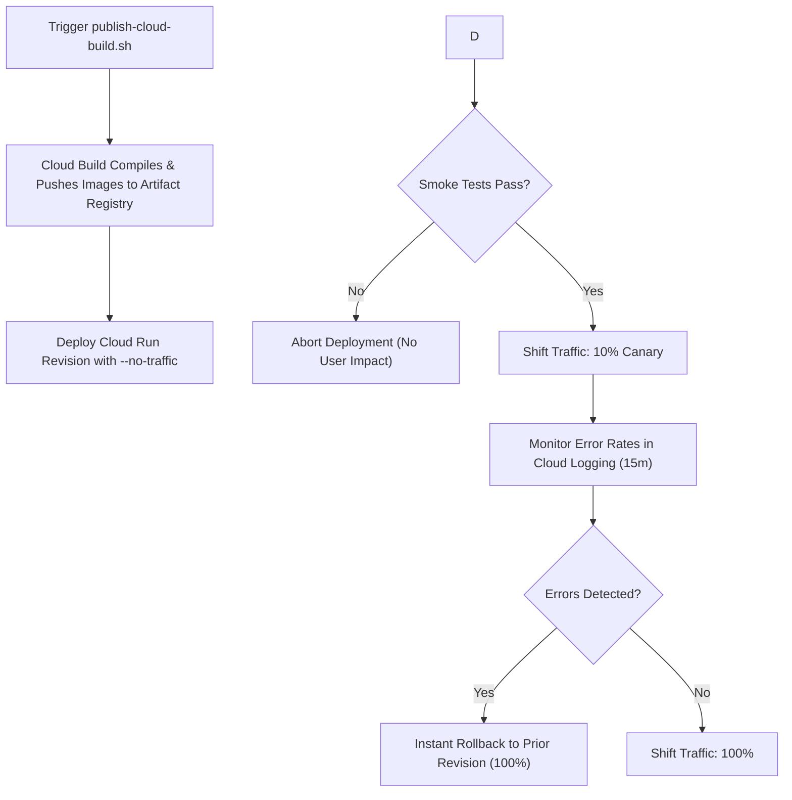

# SOP: Safe Release Deployment & Instant Rollback (Cloud Run)

| Attribute | Value |
| :--- | :--- |
| **Runbook ID** | RB-09 |
| **Type** | Standard Operating Procedure (SOP) |
| **Component** | Cloud Run, Artifact Registry, Cloud Build (`scripts/deploy/publish-cloud-build.sh`, `scripts/deploy/publish.ps1`) |
| **Primary Audience** | Release Engineers, DevOps, SRE |

---

## 1. Overview & Purpose

This standard operating procedure guides the deployment of new software versions of `obq-gateway` and `obq-hub` to Google Cloud Run using canary traffic splitting, synthetic validation, and zero-downtime 1-command rollback.

---

## 2. Prerequisites

* Authenticated `gcloud` CLI with permissions to submit Cloud Builds and deploy Cloud Run revisions (`roles/run.admin`, `roles/cloudbuild.builds.editor`).
* Artifact Registry Docker repository created in the target region.

---

## 3. Step-by-Step Deployment Procedure



### Step 1: Build & Publish Container Images via Cloud Build
Delegate container compilation directly to GCP Cloud Build without requiring local Docker:

**Using Bash:**
```bash
./scripts/deploy/publish-cloud-build.sh -p <PROJECT_ID> -r <REGION> -repo <REPOSITORY_NAME> -t $(git rev-parse --short HEAD)
```
*(Or use `./publish.sh`, which forwards directly to this script).*

**Using PowerShell:**
```powershell
.\scripts\deploy\publish.ps1 -p <PROJECT_ID> -r <REGION> -repo <REPOSITORY_NAME> -t $(git rev-parse --short HEAD)
```

### Step 2: Deploy New Revision with Zero Initial Traffic (`--no-traffic`)
Deploy the newly published image to Cloud Run without directing live user traffic to it:

```bash
TAG=$(git rev-parse --short HEAD)
IMAGE="<REGION>-docker.pkg.dev/<PROJECT_ID>/<REPOSITORY_NAME>/obq-gateway:${TAG}"

gcloud run deploy odata-gateway \
  --image="${IMAGE}" \
  --region="<REGION>" \
  --no-traffic \
  --tag="canary-${TAG}"
```

### Step 3: Run Smoke Tests Against the Canary Revision URL
Cloud Run assigns a dedicated, private URL to the tagged revision (e.g., `https://canary-<TAG>---odata-gateway-...run.app`):

```bash
REVISION_URL=$(gcloud run revisions describe $(gcloud run revisions list --service=odata-gateway --region=<REGION> --format="value(name)" --limit=1) --region=<REGION> --format="value(status.url)")

# 1. Test Health Endpoint
curl -i "${REVISION_URL}/health"

# 2. Test Metadata Discovery
curl -i -H "Authorization: Bearer <TEST_TOKEN>" "${REVISION_URL}/v1/<PROJECT>/<DATASET>/\$metadata"
```

### Step 4: Progressive Traffic Migration
If synthetic smoke tests succeed, gradually route production traffic:

1. **Route 10% to canary:**
   ```bash
   gcloud run services update-traffic odata-gateway \
     --region="<REGION>" \
     --set-tags="canary-${TAG}=10"
   ```
2. **Observe telemetry for 15 minutes:** Verify no increase in 5xx errors or latency spikes.
3. **Route 100% to new revision:**
   ```bash
   gcloud run services update-traffic odata-gateway \
     --region="<REGION>" \
     --to-latest
   ```

---

## 4. Instant Rollback Procedure

If unhandled errors, memory leaks, or protocol regressions are detected in production:

### 1-Command Immediate Rollback
Identify the last known healthy revision and route 100% of traffic back to it:

```bash
# List recent revisions
gcloud run revisions list --service=odata-gateway --region="<REGION>" --limit=5

# Rollback immediately to prior stable revision
gcloud run services update-traffic odata-gateway \
  --region="<REGION>" \
  --to-revisions=<HEALTHY_REVISION_NAME>=100
```

Traffic switches instantaneously with zero dropped in-flight requests.
