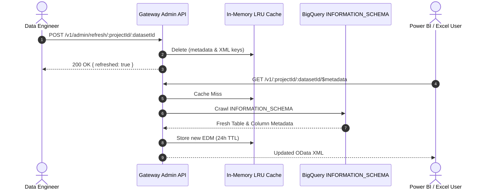

# SOP: BigQuery Schema Evolution & Metadata Cache Invalidation

| Attribute | Value |
| :--- | :--- |
| **Runbook ID** | RB-07 |
| **Type** | Standard Operating Procedure (SOP) |
| **Component** | `obq-gateway` (`plugins/00-metadata-cache.ts`, `services/bq-introspection.ts`) |
| **Primary Audience** | Data Engineers, Analytics Engineers, SRE |

---

## 1. Overview & Purpose

The gateway maintains a high-performance in-memory LRU cache with a **24-hour TTL** to keep `$metadata` response times sub-second.

When upstream data pipelines add columns, rename tables, or alter foreign-key relationships in BigQuery, BI tools querying the gateway will not see these changes until the cache entry expires or is explicitly flushed. This SOP outlines how to force immediate cache invalidation.

---

## 2. Prerequisites

* Admin bearer token or administrative endpoint access.
* Target `projectId` and `datasetId` experiencing schema drift.

---

## 3. Step-by-Step Procedure



### Step 1: Execute Targeted Invalidation (Recommended)
To flush the cache for a single dataset without impacting other tenants:

```bash
curl -i -X POST \
  -H "Authorization: Bearer <ADMIN_TOKEN>" \
  https://<gateway-domain>/v1/admin/refresh/<PROJECT_ID>/<DATASET_ID>
```

**Expected Response:**
```json
{
  "projectId": "sales-lakehouse-prod",
  "datasetId": "finance_mart",
  "refreshed": true
}
```

### Step 2: Alternative — Global Cache Invalidation
If a widespread migration occurred affecting multiple datasets across projects:

```bash
curl -i -X POST \
  -H "Authorization: Bearer <ADMIN_TOKEN>" \
  https://<gateway-domain>/v1/admin/refresh-all
```

**Expected Response:**
```json
{
  "status": "success"
}
```

### Step 3: Verify the Generated EDM XML
Call the `$metadata` endpoint to trigger an automatic re-crawl of BigQuery's `INFORMATION_SCHEMA`:

```bash
curl -s "https://<gateway-domain>/v1/<PROJECT_ID>/<DATASET_ID>/$metadata" \
  -H "Authorization: Bearer <TOKEN>" | grep -i "<NEW_COLUMN_OR_TABLE_NAME>"
```

Ensure:
* The new property or entity set is present.
* Column types (e.g., `Edm.String`, `Edm.Int64`, `Edm.Decimal`) match expectations.

### Step 4: Instruct Consumers to Refresh Schema in BI Clients

#### In Power BI Desktop
1. Open the existing report.
2. In the **Home** tab, click **Transform Data** > **Transform Data** (opens Power Query Editor).
3. Right-click the affected query in the left pane and select **Refresh Preview**.
4. Click **Close & Apply**.

#### In Microsoft Excel
1. Go to **Data** > **Queries & Connections**.
2. Right-click the query and select **Refresh**.
3. If new columns still do not appear, edit the query in Power Query to ensure manual column selections (`$select`) are updated.

---

## 4. Live Discovery Fallback Note
If an analyst queries a newly created table directly by URL (e.g., `/v1/:projectId/:datasetId/NewTable`) before an admin refresh has been run, the gateway automatically executes a **targeted live check** against BigQuery, registering the table dynamically without failing.
