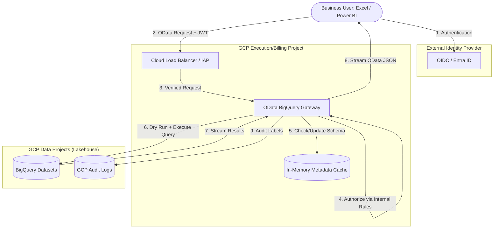

# Tasks: Deployment & Implementation Matrix

This document outlines the operational tasks and environment configurations supported by the **OData BigQuery Gateway**. Use this matrix to select the best implementation strategy for your organization's infrastructure.

## 1. Local Deployment (Development & POC)

This procedure is for running the gateway on a local workstation for development or testing.

### Prerequisites
- **Node.js:** v20.x or higher.
- **Google Cloud SDK:** Installed and authenticated (`gcloud auth application-default login`).
- **Permissions:** Your personal account must have `roles/bigquery.dataViewer` and `roles/bigquery.jobUser` on the target project.

### Step-by-Step Procedure
1.  **Clone & Install:**
    ```bash
    git clone <repo-url>
    cd odata-gateway-bq
    npm install
    ```
2.  **Configure Authentication (ADC):**
    Instead of using a service account key locally, use your personal identity. This is safer and easier for development.
    ```bash
    gcloud auth application-default login
    ```
    *This command will open a browser to authenticate you and save a local credential file that the BigQuery SDK will automatically detect.*

3.  **Configure Environment:**
    Create a `.env` file or export variables:
    ```bash
    export BQ_BILLING_PROJECT_ID="your-project-id"
    export OIDC_ISSUER="http://localhost/" # Mock issuer for local dev
    export OIDC_AUDIENCE="test-audience"
    export ANONYMOUS_MODE="true" # Enable for easier local testing
    export ENABLE_QUERY_BUILDER="false" # Disabled by default
    ```
3.  **Build & Start:**
    ```bash
    npm run dev
    ```

### Validation Tests
- **[ ] Process Check:** Run `ps aux | grep node`. You should see the Fastify process running on port 3000.
- **[ ] Health Check:** Run `curl http://localhost:3000/health`. Expect: `{"status":"ok"}`.
- **[ ] Metadata Discovery:** Open `http://localhost:3000/v1/your-project/your-dataset/$metadata` in a browser. Expect a valid XML OData schema.

---

## 2. On Google Cloud (Production Scale)

The recommended production path using **Google Cloud Run** for serverless scalability.

### Prerequisites
- **GCP Project:** With BigQuery and Artifact Registry APIs enabled.
- **Service Account:** A dedicated SA with BigQuery viewer/job permissions.
- **Workload Identity:** Configured if deploying via CI/CD.

### Step-by-Step Procedure
1.  **Build & Tag Image:**
    ```bash
    docker build -t gcr.io/[PROJECT_ID]/odata-gateway-bq:v1 .
    ```
2.  **Push to Registry:**
    ```bash
    docker push gcr.io/[PROJECT_ID]/odata-gateway-bq:v1
    ```
3.  **Deploy to Cloud Run:**
    ```bash
    gcloud run deploy odata-gateway-bq \
      --image gcr.io/[PROJECT_ID]/odata-gateway-bq:v1 \
      --platform managed \
      --region [REGION] \
      --set-env-vars BQ_BILLING_PROJECT_ID=[PROJECT_ID],OIDC_ISSUER=[URL],ENABLE_QUERY_BUILDER=false \
      --service-account [SERVICE_ACCOUNT_EMAIL] \
      --allow-unauthenticated # If using OIDC inside the app
    ```

### Validation Tests
- **[ ] Deployment Status:** Check the Cloud Run console. The service status must be "Green/Ready".
- **[ ] IAM Verification:** Run a test query via the Cloud Run URL. If it fails with "403 Access Denied", check the Service Account roles.
- **[ ] Audit Trail:** Run a query and check **Cloud Logging**. Search for `protoPayload.serviceData.jobCompletedEvent`. Verify the `labels` contains your user identity.

---

## 3. On Premise (Private Cloud / Hybrid)

For deployment in private data centers requiring connection to Google Cloud. Supported exclusively on **Virtual Machines (VM)**, **Kubernetes**, and **OpenShift**.

### Prerequisites
- **Platform:** Linux VM (Node.js 20+), Kubernetes Cluster, or OpenShift Container Platform.
- **Container Runtime:** Docker or Podman (for K8s/OpenShift).
- **Network Connectivity:** Dedicated Cloud Interconnect or Cloud VPN to reach `*.googleapis.com`.
- **Service Account Key:** A downloaded JSON key (stored securely).

### Step-by-Step Procedure (VM)
1.  **Launch Container:**
    ```bash
    docker run -d --name odata-gateway \
      -p 8080:3000 \
      -v $(pwd)/config:/app/config \
      -v /path/to/key.json:/app/key.json \
      -e GOOGLE_APPLICATION_CREDENTIALS=/app/key.json \
      -e BQ_BILLING_PROJECT_ID="your-project" \
      odata-gateway-bq:v1
    ```

### Step-by-Step Procedure (Kubernetes / OpenShift)
1.  **Create Secret:** `kubectl create secret generic bq-key --from-file=key.json`
2.  **Deploy Manifest:** Apply a standard Deployment and Service manifest, mounting the secret as a volume.

### Validation Tests
- **[ ] Connectivity Test:** From inside the pod/VM, run `nc -zv bigquery.googleapis.com 443`. Must return "Open".
- **[ ] Config Reload:** Run `curl -X POST http://localhost:8080/admin/config/reload`. Expect `{"status":"reloaded"}`.
- **[ ] OpenShift Security:** (OpenShift Only) Verify that the pod runs under the restricted SCC if required.

---

## 2. Hosting Models

- **Stateless Container (Recommended):** The gateway is deployed as a stateless microservice. Configuration is injected via environment variables or a shared mount. This allows for effortless horizontal scaling.
- **Managed Service (IAP Proxy):** Deploying the gateway behind **Google Cloud Identity-Aware Proxy (IAP)**. This offloads the entire authentication layer to Google's edge.
- **Hybrid Hub:** A single gateway instance serving multiple disparate BigQuery projects.

---

## 3. Supported Infrastructure

The OData BigQuery Gateway is officially supported on the following platforms only:

- **Virtual Machines (VM):** Any Linux-based environment (Ubuntu, RHEL, etc.) with Node.js 20+ or Docker.
- **Kubernetes:** Standard Kubernetes distributions (v1.24+).
- **OpenShift:** Red Hat OpenShift Container Platform (v4.x+).
- **Google Cloud Run:** Native serverless support for cloud-native deployments.

---

## 4. Implementation Environments

| Environment | Purpose | Configuration Strategy |
| --- | --- | --- |
| **Sandbox / Dev** | Feature testing | Personal user credentials; `ANONYMOUS_MODE=true` for local testing. |
| **Staging** | Integration validation | Mirror of production; uses a dedicated "Staging" Service Account and OIDC testing tenant. |
| **Production** | Live data access | High-availability (HA) configuration; strict VPC Service Controls; production OIDC (Entra ID) integration. |
## 5. Deployment Architecture

The following diagram represents the standard production architecture when deployed on Google Cloud Platform (GCP).



### High-Level Components:
- **Identity Provider (OIDC):** Handles the initial user login and issues the JWT (Json Web Token) required to access the gateway.
- **Load Balancer / IAP:** Acts as the entry point, providing TLS termination and optional Identity-Aware Proxy (IAP) protection.
- **Gateway (Cloud Run):** The core service that translates OData to SQL, enforces scan budgets, and streams data.
- **Metadata Cache:** A sharded in-memory store that ensures high performance for OData discovery ($metadata) calls.
- **BigQuery:** The source of truth for all data, accessed via a secure Service Account (Trusted Subsystem model).
